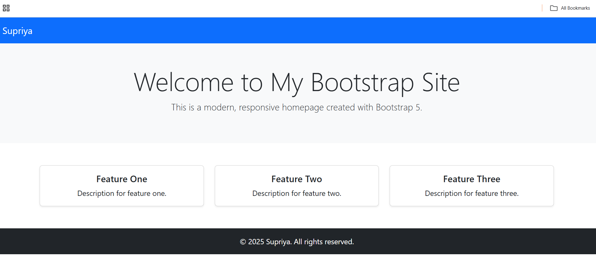
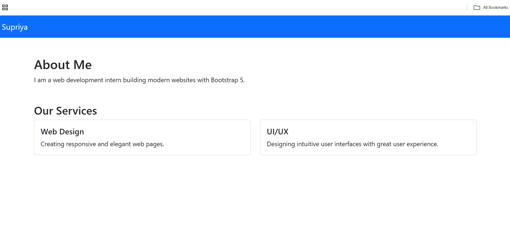
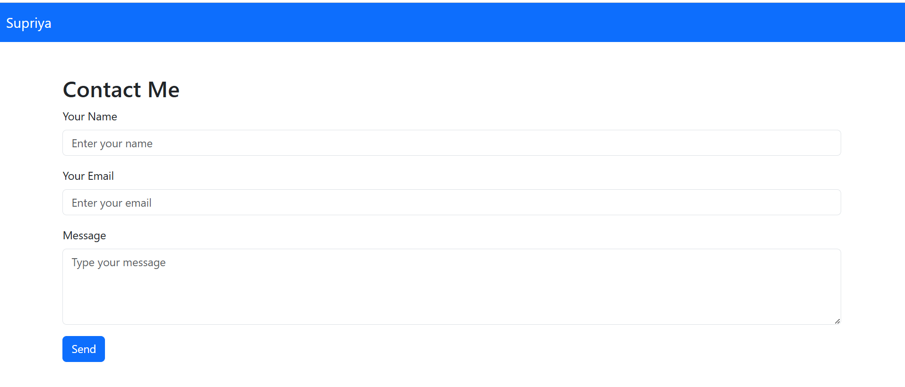
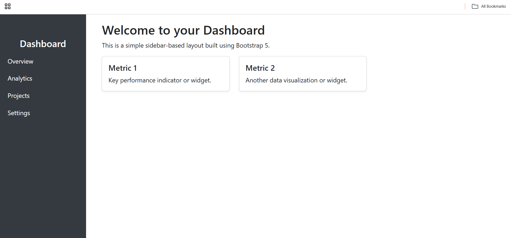
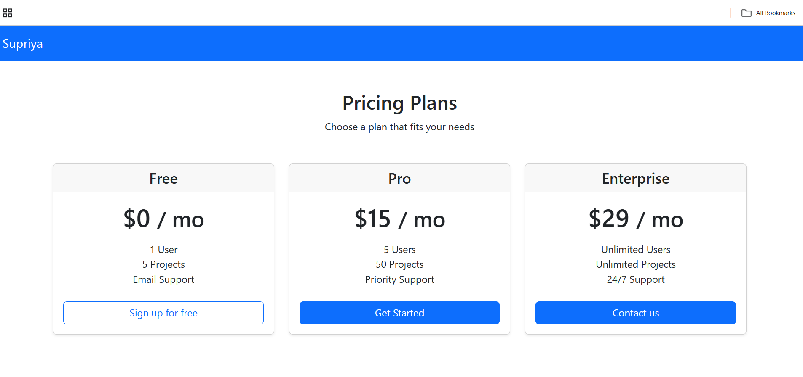

# Bootstrap UI Showcase

A responsive multi-page website built using **Bootstrap 5**, showcasing modern UI components and layouts.  
This project was developed as part of an internship task to demonstrate skills in frontend design, layout composition, and responsive web development.

## 🚀 Features
- Clean and modern homepage with hero section and feature cards
- About page with services section using Bootstrap cards
- Contact page with a styled form
- Sidebar-based Dashboard layout
- Pricing page with Bootstrap card-based pricing plans
- Fully responsive using Bootstrap 5 grid and utility classes

## 🛠 Technologies Used
- HTML5
- CSS3
- Bootstrap 5 (via CDN)
- Git & GitHub

## 📁 Pages Included
- `index.html` – Home page with hero, features, and footer
- `about.html` – About/services section
- `contact.html` – Contact form with Bootstrap styles
- `dashboard.html` – Admin-style layout with a sidebar
- `pricing.html` – Pricing plans in card layout

## 🌐 Live Preview
[View Demo](https://github.com/Sp-supriya/bootstrap-ui-showcase)  

## 📸 Screenshots

### 🏠 Home Page

### 📄 About Page

### 📬 Contact Page

### 📊 Dashboard Page

### 💳 Pricing Page

